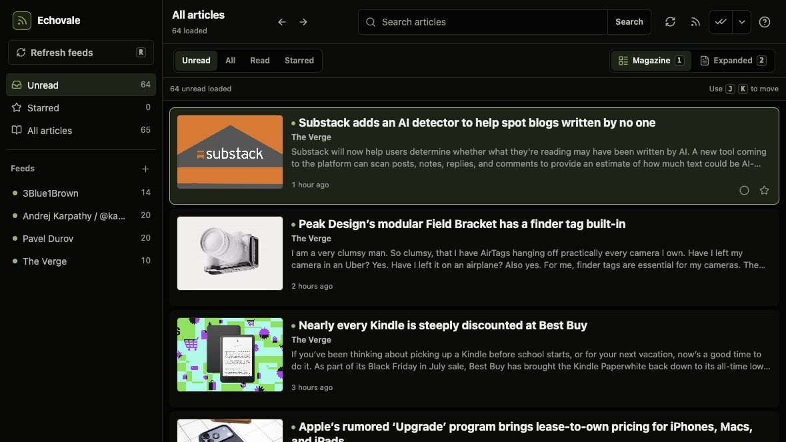
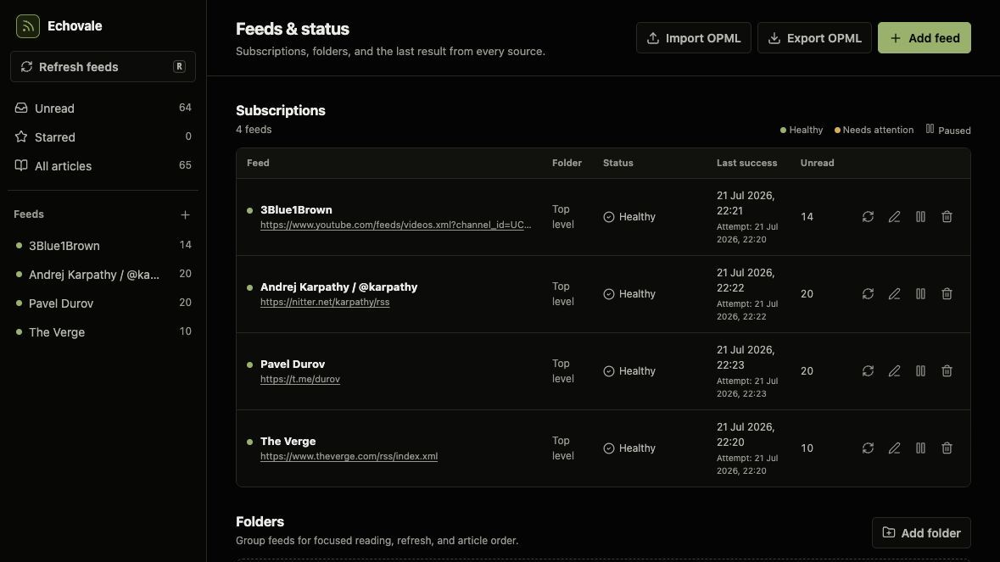
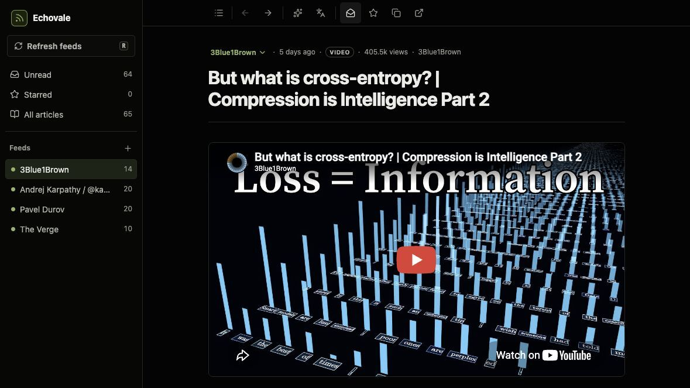
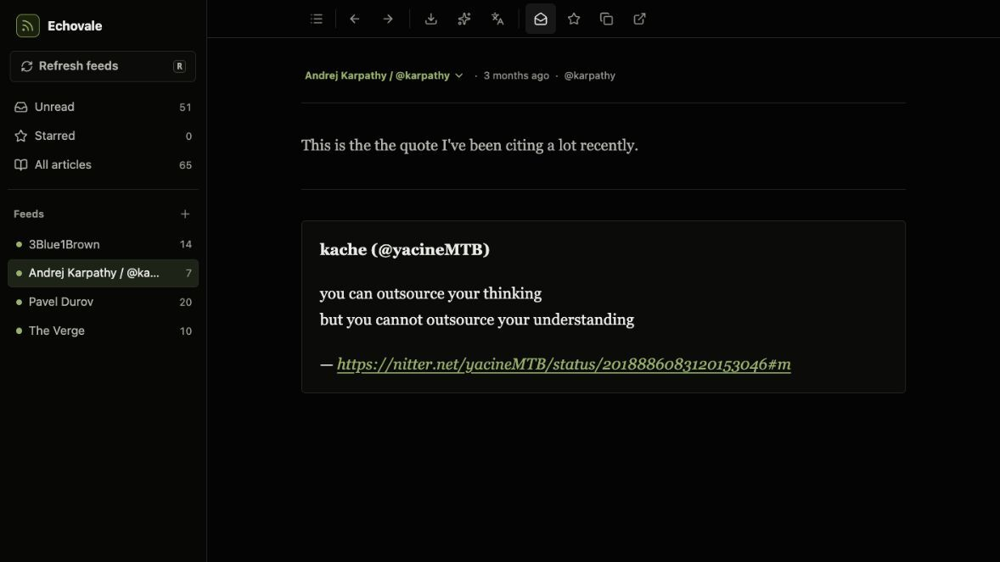

# echovale

echovale is my RSS reader for a hand-picked web. It preserves that choice instead of ranking items for engagement or inserting ads and recommendations to keep me scrolling. It gives me new things to look forward to and a place to read without staying on guard. Subscriptions and reading data stay under your control. The same is true of the software itself: you—or your coding agent—can fork it, change it locally, and shape it around the way you read.

## See echovale

| Reader | Feed health |
| :---: | :---: |
| [](docs/screenshots/reader-desktop.jpg) | [](docs/screenshots/feed-sources-desktop.jpg) |
| **YouTube article** | **Nitter / X article** |
| [](docs/screenshots/article-youtube.jpg) | [](docs/screenshots/article-nitter.jpg) |

## What echovale does

- Organizes chosen sources into a focused reading queue with unread, read, and starred views.
- Supports the complete reading workflow from the keyboard.
- Follows RSS, Atom, JSON Feed, and public webpages with repeated entries, including pages rendered by JavaScript.
- Keeps wanted articles, hides noise, or marks matches as read with rules.
- Extracts full article text while keeping feed text available as a fallback.
- Generates article summaries and translations on demand through Google Gemini, OpenAI, or Anthropic.
- Installs as a Progressive Web App with a standalone window, home-screen shortcuts, and an offline application shell.
- Imports and exports OPML with feed folders.
- Sorts each feed or folder from newest to oldest or oldest to newest. The aggregate view preserves each feed's configured order.

## Run the macOS desktop app

The Electron app is fully local. It opens no HTTP port, needs no account or hosted backend, and sends application requests through a narrow IPC bridge. SQLite, background refreshes, article extraction, and the bundled headless browser all run inside the app. The hosted version remains available separately.

For local development:

```sh
npm run dev:desktop
```

To build and open the desktop app:

```sh
npm run build && npm run desktop
```

To create distributable DMG and ZIP artifacts in `release/`:

```sh
npm run desktop:package
```

Local packages receive an ad-hoc macOS signature. Set `CSC_LINK` or `CSC_NAME` when producing a Developer ID-signed release for distribution; notarization still requires the corresponding Apple credentials.

Desktop data is stored at `~/Library/Application Support/echovale/echovale.db`. Provider API keys are encrypted with macOS secure storage before they enter SQLite. Feed refreshes continue while the app is running; use **echovale → Quit echovale** or <kbd>⌘Q</kbd> to stop it completely.

## Start echovale with Docker Compose

The included Compose deployment runs one Node.js 24.18.0 process, starts sandboxed headless Chromium when a web feed loads, and stores SQLite data in a named volume.

You need Docker Engine with Docker Compose v2.

1. Build and start echovale:

   ```sh
   docker compose up -d --build
   ```

2. Open `http://127.0.0.1:3000/echovale/`.

3. Choose **Create an account**. Registration signs in the new account immediately. echovale hashes passwords before storing them in SQLite.

4. Check that the container is ready:

   ```sh
   docker compose ps
   ```

5. Check that the server can query SQLite:

   ```sh
   curl --fail http://127.0.0.1:3000/health
   ```

The health endpoint returns HTTP 200 when the SQLite query succeeds. Application data is stored in the `echovale-data` volume at `/data/echovale.db`.

To follow the server logs:

```sh
docker compose logs -f --tail=200 echovale
```

To stop echovale without deleting its data:

```sh
docker compose down
```

Adding `--volumes` to this command permanently deletes the SQLite database.

Do not scale echovale to multiple application replicas. Background polling and SQLite ownership are designed for one process.

### Add another account

Sign out, choose **Create an account**, and register the next user. Accounts are isolated from each other.

When you upgrade an existing single-account database, the first account registered after the upgrade receives its feeds, folders, rules, settings, and article state. Later accounts begin with an empty reading queue.

## Keep access private

echovale uses password authentication, but anyone who can reach the sign-in screen can register. Compose therefore publishes the service on host loopback by default.

For access from another device, use a trusted private network or an HTTPS reverse proxy with its own access controls. Do not publish echovale through Tailscale Funnel or an unrestricted public proxy unless you intend to allow open registration.

### Publish echovale to a Tailscale network

On a host connected to Tailscale, publish the loopback service to its tailnet:

```sh
sudo tailscale serve --bg --https=443 http://127.0.0.1:3000
```

The command prints the private `https://<device>.<tailnet>.ts.net` address. HTTPS also enables browser features such as copy to clipboard. Tailscale Serve provisions the certificate and keeps a `--bg` configuration across restarts. See the [Tailscale Serve command reference](https://tailscale.com/docs/reference/tailscale-cli/serve).

To inspect the active configuration:

```sh
tailscale serve status
```

To stop publishing the service:

```sh
sudo tailscale serve --https=443 off
```

## Configuration reference

Compose reads these values from the shell or a project-level `.env` file:

| Variable | Default | Purpose |
| --- | --- | --- |
| `ECHOVALE_BIND_ADDRESS` | `127.0.0.1` | Host address that publishes the container port. Keep loopback when a local reverse proxy provides access. |
| `ECHOVALE_PORT` | `3000` | Host port forwarded to echovale. |
| `POLL_INTERVAL_MINUTES` | `20` | Initial polling interval for published feeds in a new database. |
| `FEED_FETCH_TIMEOUT_MS` | `15000` | Feed request timeout, in milliseconds. |
| `WEB_FEED_LOAD_TIMEOUT_MS` | `30000` | Maximum normal load time for a JavaScript-rendered web feed, in milliseconds. |
| `ARTICLE_FETCH_TIMEOUT_MS` | `20000` | Full-article request timeout, in milliseconds. |
| `AI_CREDENTIALS_KEY` | none | Persistent 64-character hexadecimal key used to encrypt provider API keys. AI key storage remains unavailable until this is set. |
| `AI_REQUEST_TIMEOUT_MS` | `60000` | AI provider request timeout, in milliseconds. |

The container fixes its internal runtime settings to `HOST=0.0.0.0`, `PORT=3000`, and `DATABASE_PATH=/data/echovale.db`. For a non-container deployment, `.env.example` lists every server setting.

After changing container configuration, recreate the service:

```sh
docker compose up -d
```

The server continues background polling when no browser is open. Published feeds use the interval from `POLL_INTERVAL_MINUTES` until you change it in **Settings**. Changes made in **Settings** are stored in SQLite and survive restarts. Web feeds refresh every three hours and can also be refreshed manually.

## Add a web feed

Use a web feed when a public page has repeated entries but no published RSS, Atom, or JSON Feed.

1. In **Manage feeds**, choose **Add feed**.
2. Enter any page on the website and choose **Check URL**. echovale looks for a published feed first.
3. If no published feed exists, choose **Create web feed**.
4. Choose a suggested entry group, or select one representative entry in the page preview.
5. Review the feed preview and choose **Add web feed**.

During a refresh, echovale reloads the configured page in Chromium. It updates existing links, adds each new link once, and keeps entries that disappear from the page in feed history. When an entry has no publication date, echovale uses the time it first discovered the entry.

If the page changes and the saved selection stops matching, open the feed's actions and choose **Edit page selection**. Repairing the selection keeps saved articles and their reading state.

### Web feed limits

A web feed follows repeated entries from one publicly accessible page after a normal load. It does not:

- sign in to a website;
- bypass a paywall, CAPTCHA, bot check, or other access control;
- follow pagination or crawl an entire website;
- monitor arbitrary text or prices;
- compare screenshots.

echovale reports temporary loading failures and JavaScript timeouts separately from a broken saved selection. It rejects pages that cannot become reliable feeds before creating a subscription.

The Compose deployment runs Chromium as the non-root application user with its Linux sandbox enabled. It uses the version-pinned [Playwright seccomp profile](https://github.com/microsoft/playwright/blob/v1.62.0/utils/docker/seccomp_profile.json) and restores only the `SYS_CHROOT` capability required by that sandbox.

## Enable AI summaries and translations

1. Generate a persistent encryption key:

   ```sh
   openssl rand -hex 32
   ```

2. Save the generated value as `AI_CREDENTIALS_KEY` in the project-level `.env` file.
3. Recreate the service.
4. Open **Settings → AI**.
5. Choose Google Gemini, OpenAI, or Anthropic.
6. Enter a model ID and save the provider's API key.

Summaries, translations, and custom prompts use the same provider and model. Each provider begins with a recommended model ID, but the model field accepts any model available to your provider account. You can edit the default summary and translation prompts for each echovale account and add named prompts to the article's AI menu.

echovale encrypts provider keys per account before storing them in SQLite. It does not return a saved key to the browser.

## Update echovale

1. Pull the latest commit:

   ```sh
   git pull --ff-only
   ```

2. Rebuild and restart the service:

   ```sh
   docker compose up -d --build
   ```
